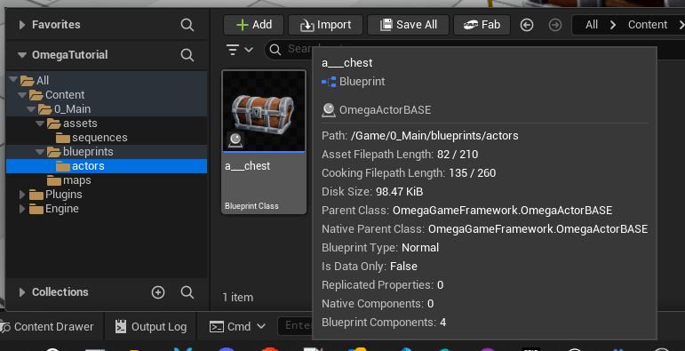
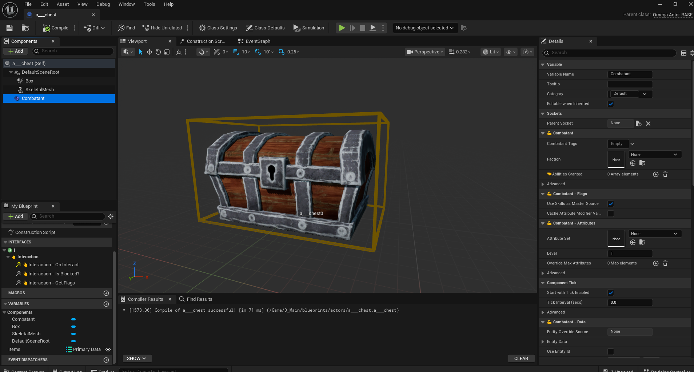
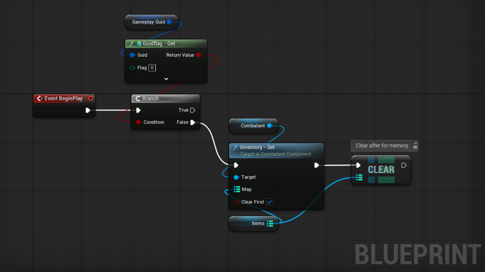
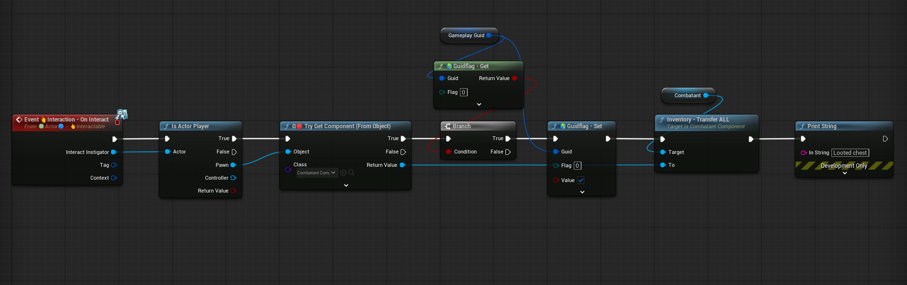

## Chests (Actor)

Chests are common in many game types, especially RPGs. To make a simple chest actor with OGF.

### Setup
* Create a new actor. (E.G. `a___chest`) Preferably a child of `OmegaBaseActor`

* Add a `SkeletalMesh` & `Box` component, as well as a  `CombatantComponent` which will store the current inventory items.

* Add the `ActorInterface_Interactable` interface.

* Add a `TMap<UPrimaryDataAsset, int32>` called something like `items`.

Generally you can make 2 kinds of chests you can make:
- **Oneshots**: Only have a looted or non-looted status. Take up the least memoery and savedata. (Common for JRPGs)
- **Entity-based**: Save the entire combatant entity. Takes more memory, but allows saving more detailed save-data. (Common for CRPGs)

For this instance we will only cover oneshot type chests.

### Oneshot
* For oneshot, on interaction we check if this actor's GameplayGuid (only avaialbe for `OmegaBaseActor`) has a flag as true (we'll use flag `0`). This marks it as "Opened/Looted". if not, set it true, and transfer the combatant inventory to the player inventory.

* On BeginPlay, check of guidflag 0 is true, and if NOT, add the `Items` map to the Combatant inventory, initing the owned items.

Now whenever your player pawn triggers an interact on this actor, is inventory will be transfered to the player.