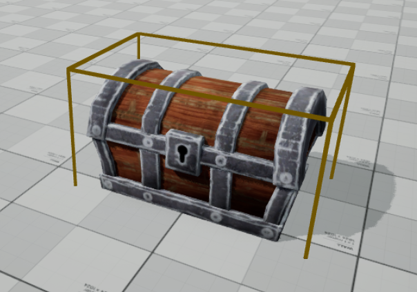
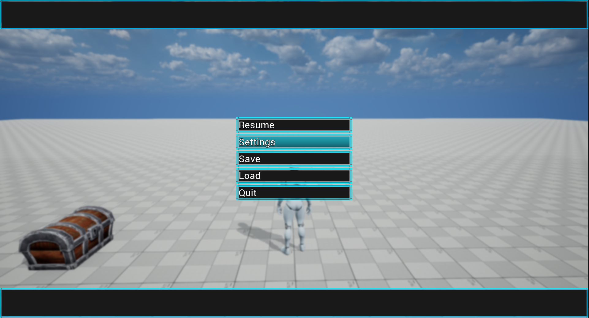

# Demo Examples

These are mini demo docs for various exmaples of things you can easily make with OGF.

## Actors

|  |  |
| -- | -- |
| [Chest](actors/chest/demo_actor_chest.md) |  
| Field/Encounter Enemies | TBD
| Portal | TBD

## Gameplay System

|  |  |
| -- | -- |
| Exploration/Gameplay | TBD
| Dialogue | TBD
| Interaction | TBD
| Cutscene | TBD

## Menus

|  |  |
| -- | -- |
| [Title Screen](menus/title/demo_menu_title.md) | 
| [Pause](menus/pause/demo_menu_pause.md) | 
| Choice | TBD
| Save/Load | TBD
| Settings | TBD
| BattleCommand | TBD

## Abilties

|  |  |
| -- | -- |
| Jump | TBD
| Crouch | TBD
| Sprint | TBD
| Attack (Simple) | TBD