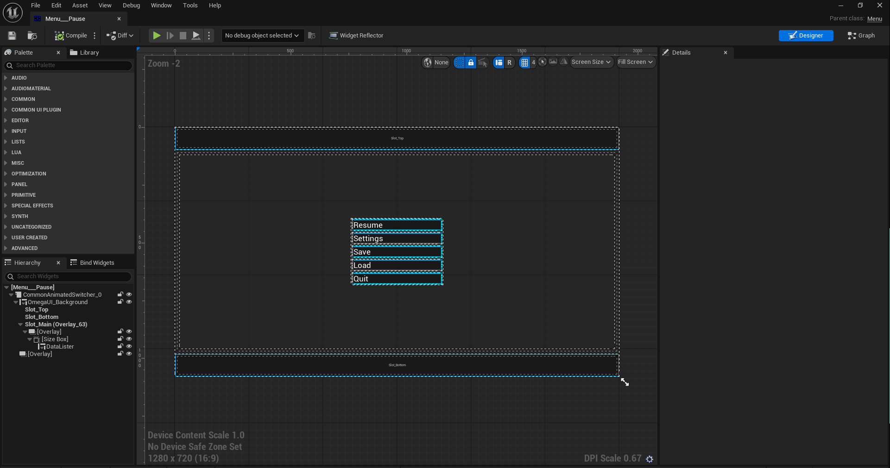
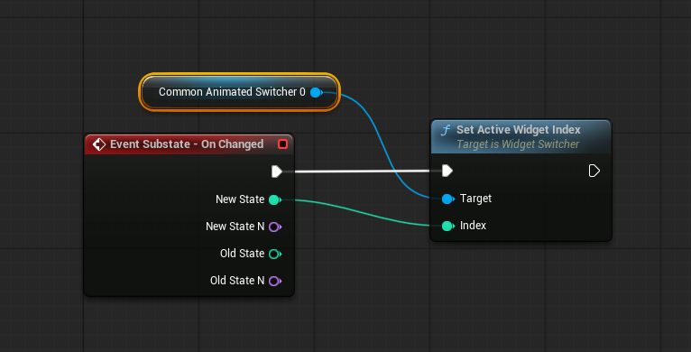
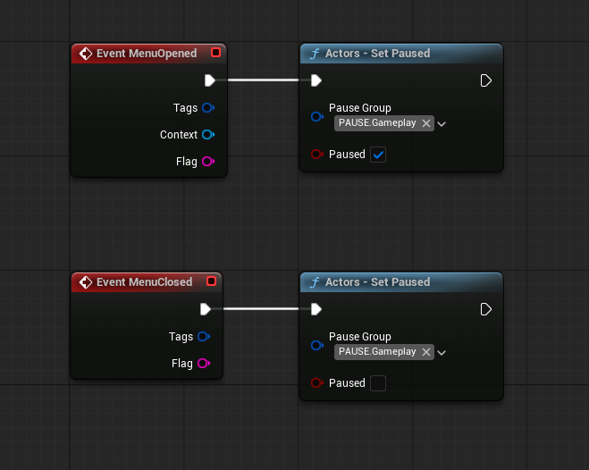
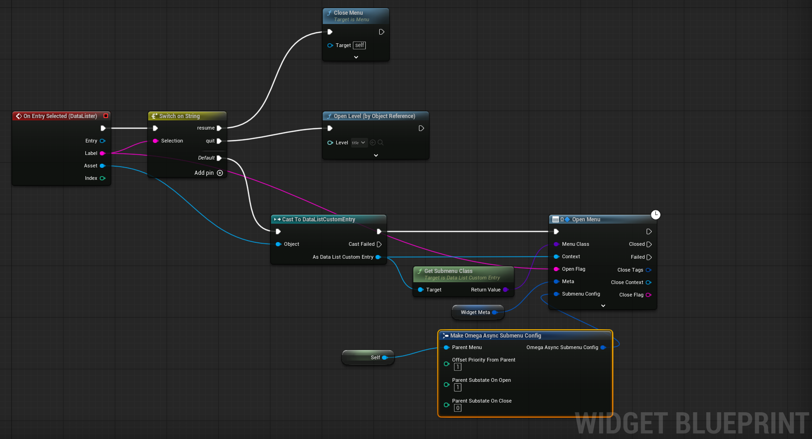
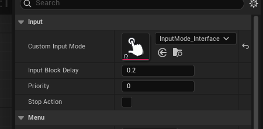
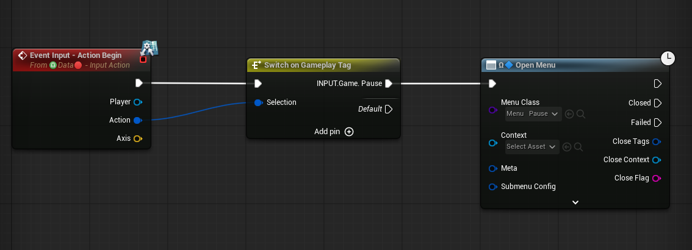

# Pause (Menu)

* Create a new menu, call it something like `Menu_Pause`. 

* Add a `WidgetSwitcher` for the menu state and a `DataList` for root options. Add whetever options you want, but typically they should have Submenu classes.

* Bind the Widget State to change when the menu substate changes.

* Pause which actors you want on menu open/close (these are set in the actor's GameplayActorComponent)

* Setup the root options DataList like this On Select.

* Set the Input Mode to something with mouse input enabled (Like the included `InputMode_Interface`)

* Assign the menu to be opened on some input action. (Typically this is done in your main gameplay system OR in the player pawn)

You now have a fully working Pause Menu!