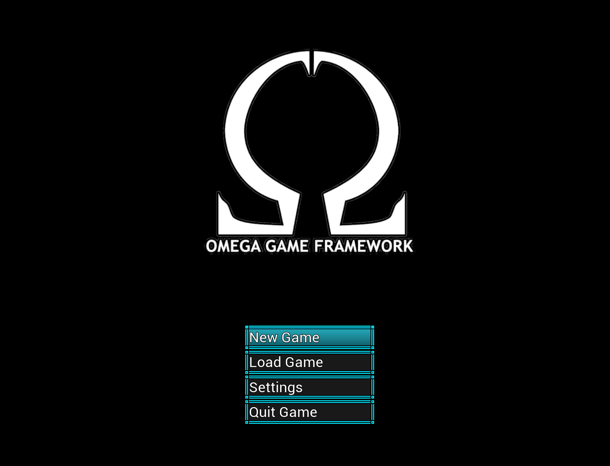
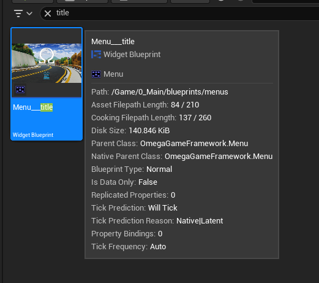
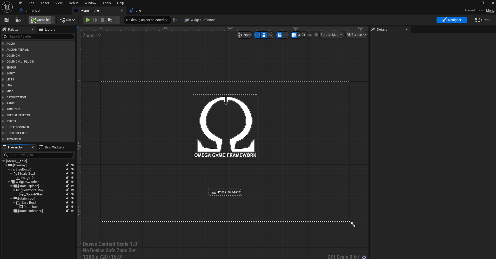
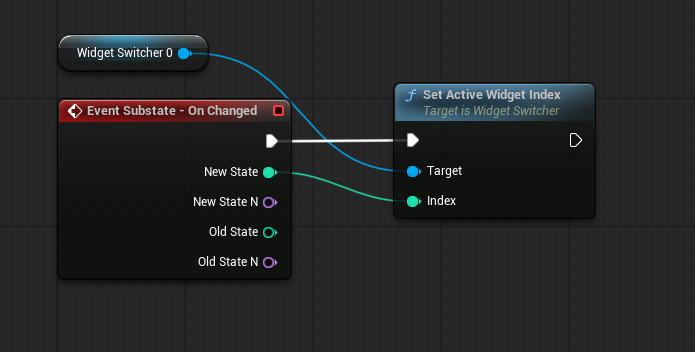
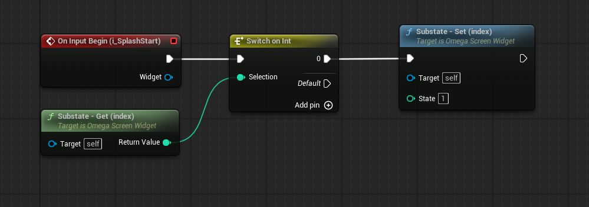
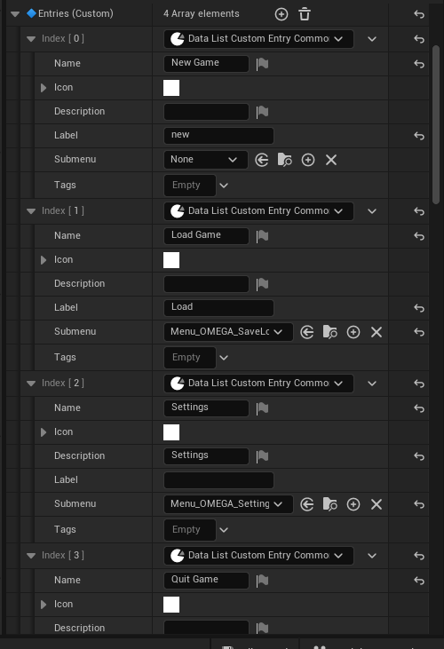
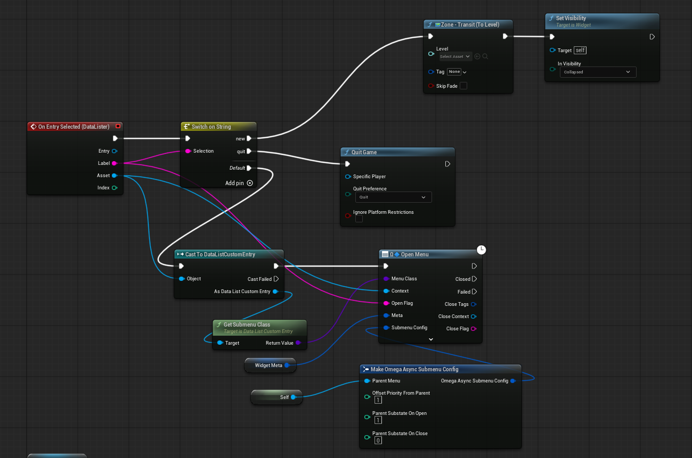
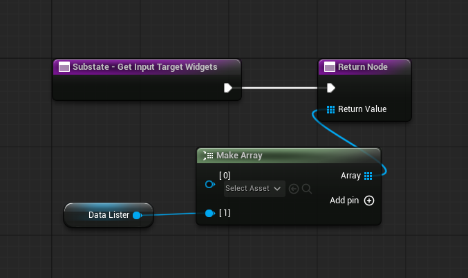
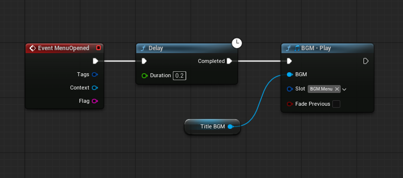

# Title Screen (Menu)

To create a title screen menu.
* Create a new `Menu` class.

* Add a few widgets to it:
    * `Image` (for the game logo)
    * `WidgetSwitcher` (for the menu states)
    * `InputActionIndicator` (For the "Press to Start' splash)
    * `DataList` (for the menu options)

* Override Event `Substate - On Changed` so that when the Menu's substate is changed, we switch to the corresponding index of the widget switcher.

* For the `InputActionIndicator`, let the desired input action (You can refer to the build in OmegaGameplayConfig asset for some). Then bind the input trigger event to (if we're on menu substate 0) change to menu substate 1 (the root)

* For the `DataList` lets add 4 options:
    * NewGame - Will open the default level
    * Load Game - Will open the Save/Load menu with the `load` flag (We'll use the default Omega SaveLoad menu for this.)
    * Settings - Opens the Settings Menu (We'll use the default Omega Settings menu for this.)
    * Quit Game - Quits the Game

* Setup the code for when the DataList option is selected like this. If not start & quit, we will try to open into the options designated submenu. 

The submenu meta allows use to specifiy its input priority (typically `1` to it is ` level high than this, its parent menu) as well as what substate of this menu to change to on open and close (in this case open=2 [submenu] and close=1 [root options])

* Override the function `Substate - Get Input Target Widgets` to set which widgets have our input focus during what menu substate. (In this case, only `1` which uses the DataList.)

* Lets add a BGM to play a moment after the menu opens

You how have a working Title Screen!