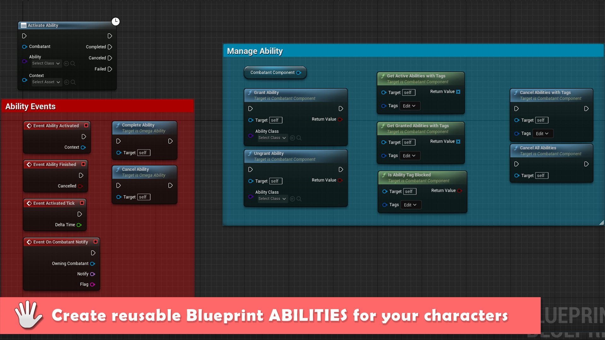
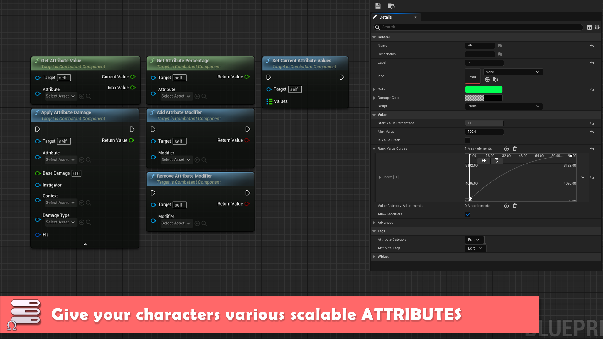
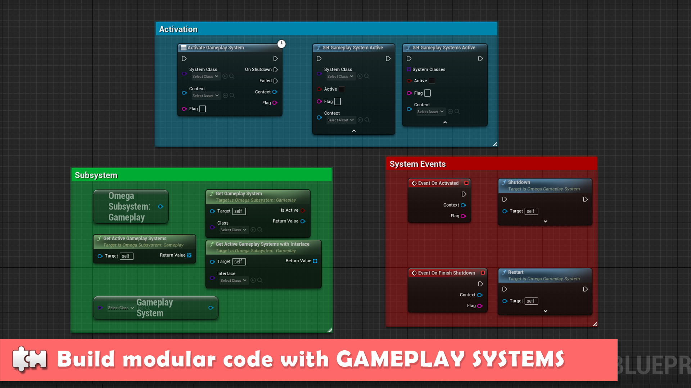
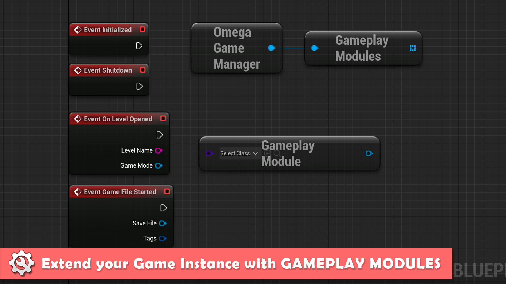
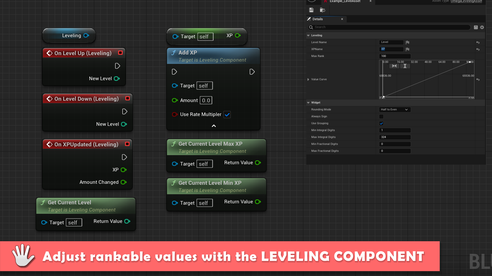
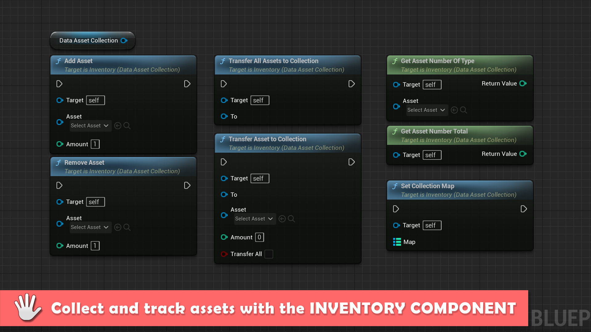
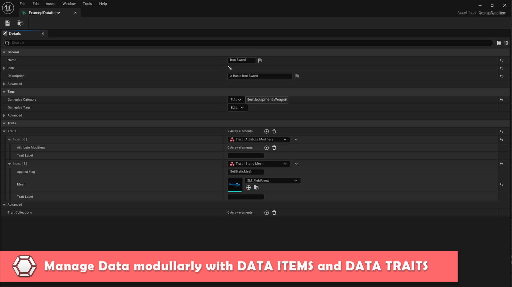
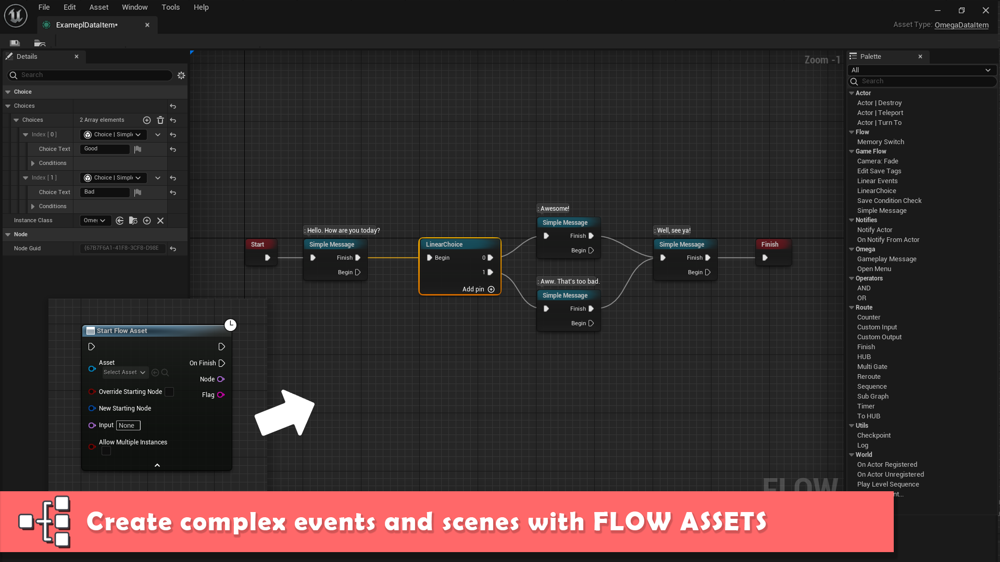
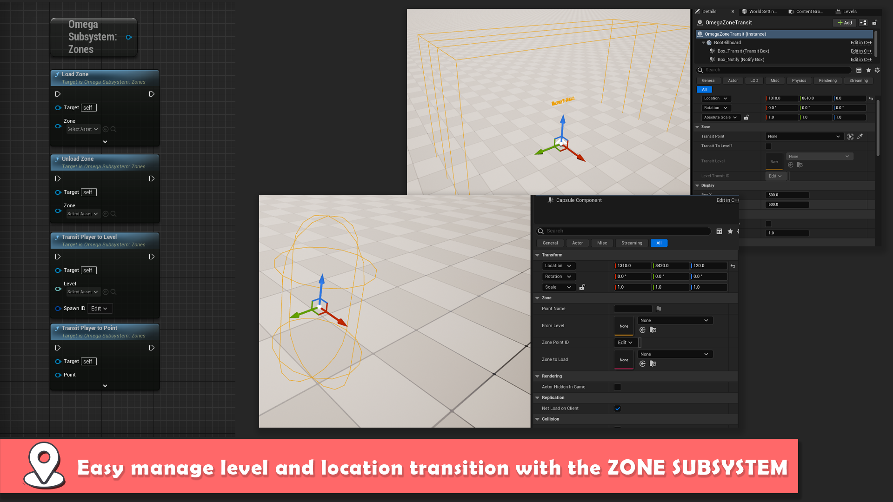

 <h2>Your one-stop for easy game development in Unreal Engine. </h2>

Omega Game Framework is a free, open-source high-level plugin for Unreal Engine that aims to vastly streamline the process of game development by providing many common and useful features and game systems out of the box. 
### Links
* [DOCUMENTATION](docs/documentation.md)
* [Website](https://www.studiosyndicat.com/omegagameframework)
* [Unreal Engine Marketplace](https://www.unrealengine.com/marketplace/en-US/product/2ca6202e55f44cfd82659fbca6591603)

### Features:

|-|-|
|-|-|
|  | 
|  | 
|  | 
|  | 
|  | 
|  | 
