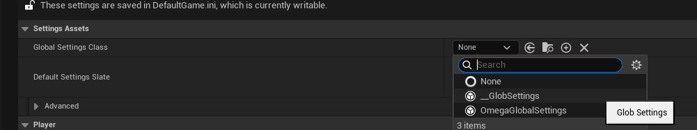
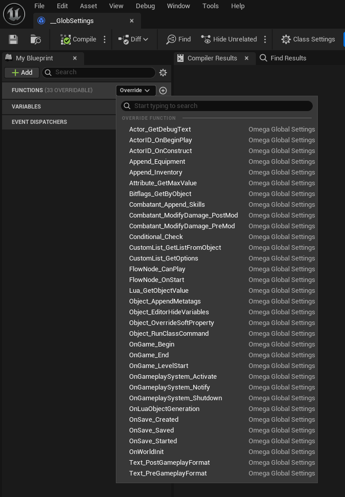

# Game Core

The `UOmegaGameCore` is a GOBAL CONSTANT blueprint class that works in both editor and runtime. It provides a long list of functions that allow you to tap into & modify tons of core Omega Game Framework functionality per-project, all in one blueprint.

#### Setup
1. Create a new `UOmegaGameCore` blueprint
2. Assign it in `Project Settings > Omega Settings`

3. Open it and start modifying the various engine/framework functionality
