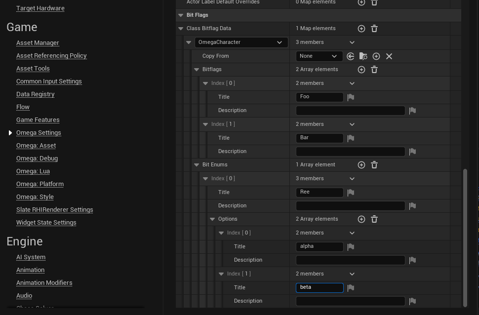
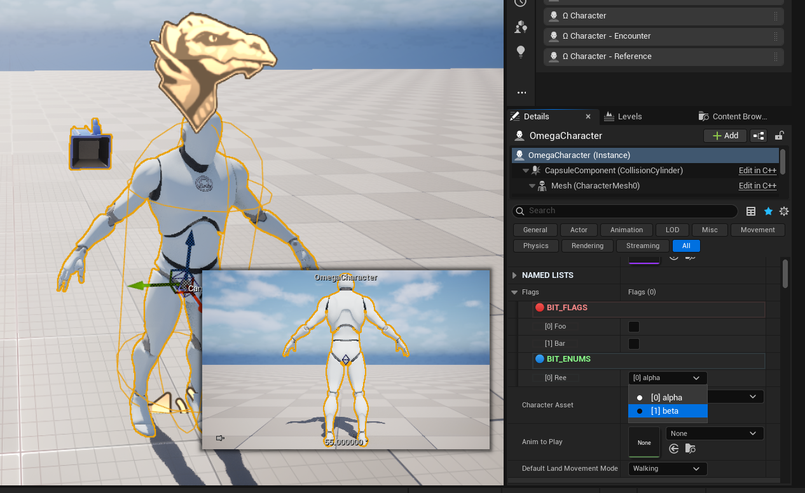
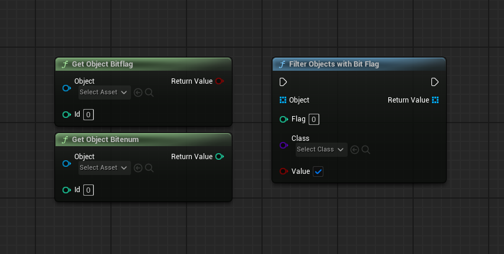

# BITFLAGS & BITENUMS

Bitflags & Bitenums are per-project & per-class defined properties that are stored in 2 integers, thus both reducing memory cost & simplifying adding new parameters to objects.

### SETUP
1. In `Project Settings > Omega Settings` add a new class to `Class Bitflag Data`. Then from there you can define the bitflags for that class.

2. To use bitflags, a class must have a bitflag struct & use the bitflag interface. (Many core OGF classes, such as `OmegaCharacter` already have bitflags on them)
3. Now any instance of that object will display it's bitflags visible for editing.

4. Access and use these bitflag values in blueprints
