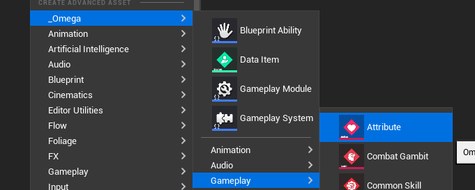
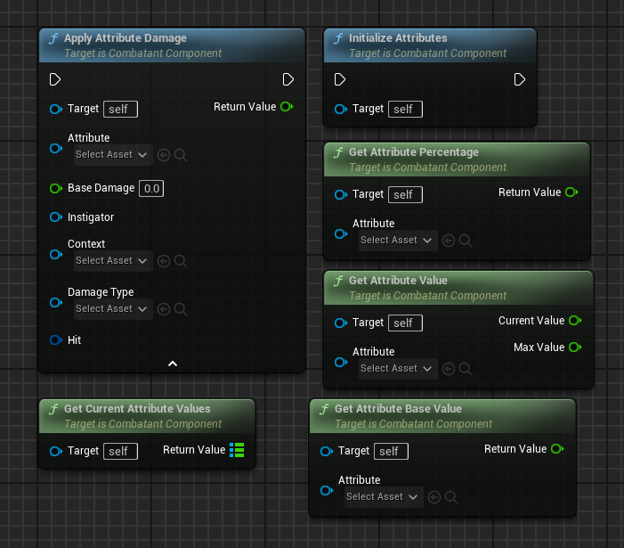
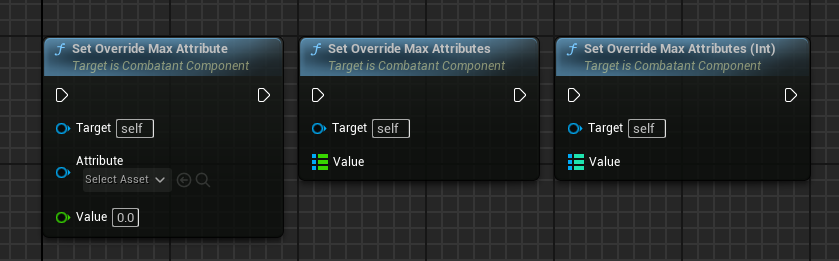
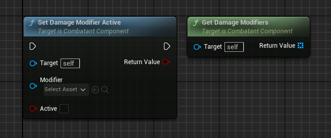
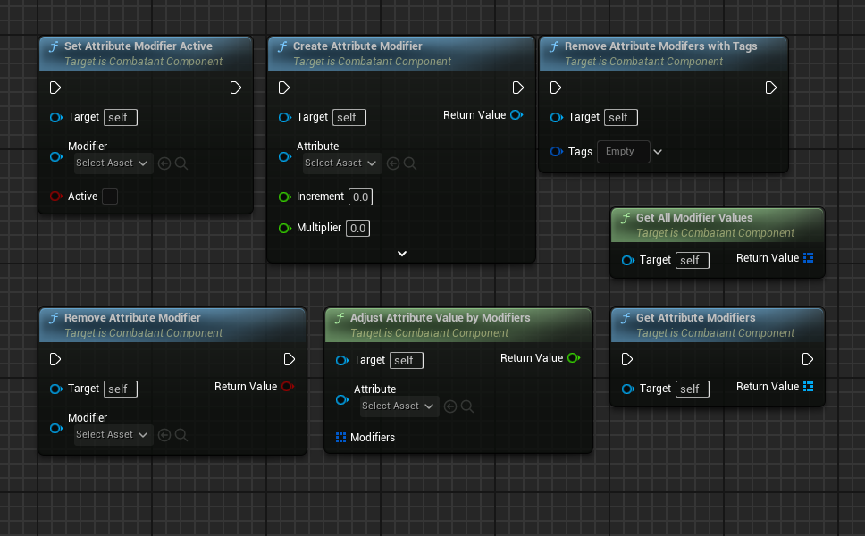
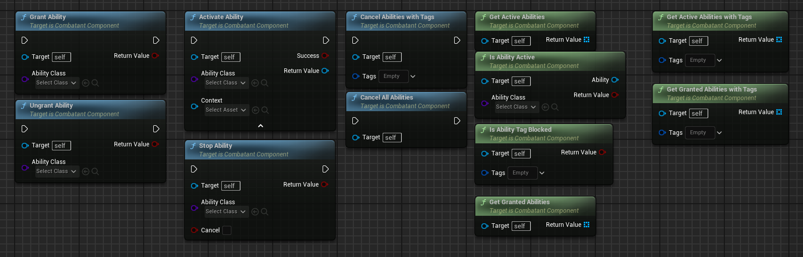
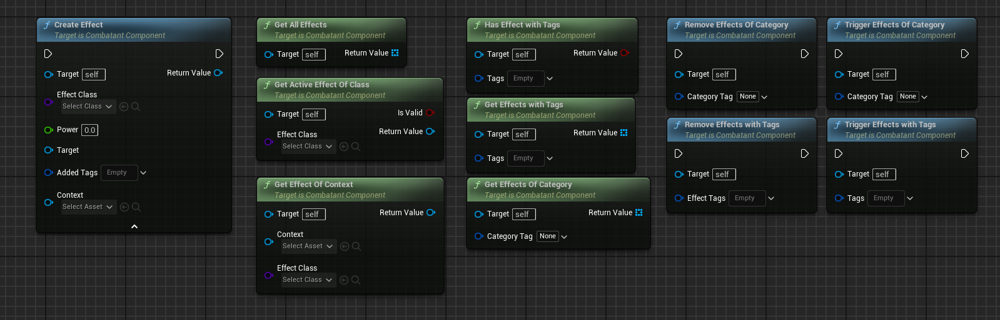
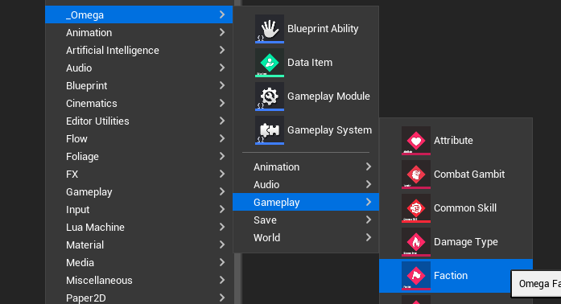
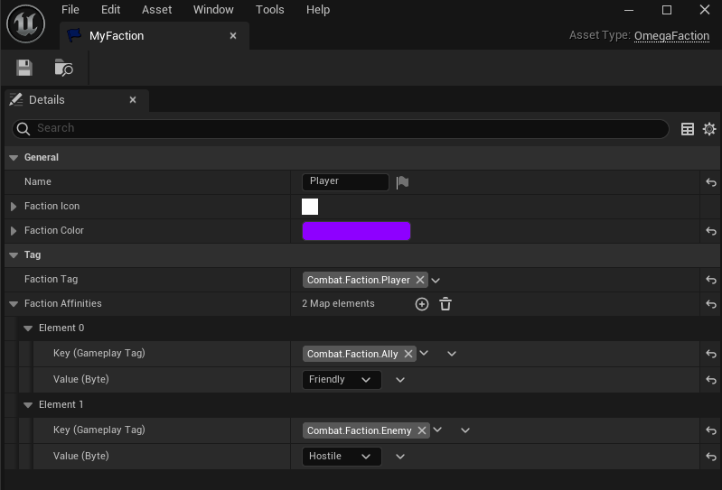
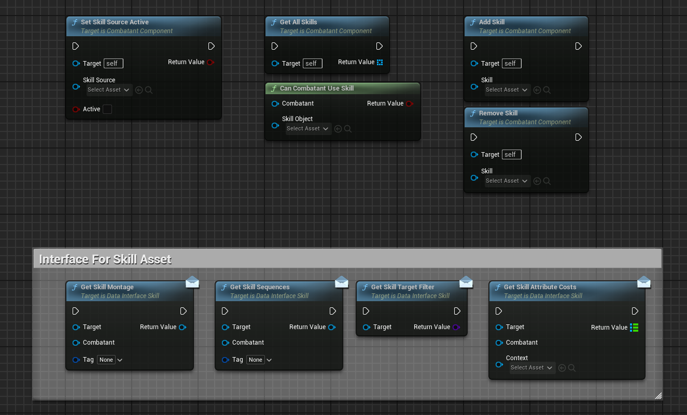

# Combatant Component
Combatants a primary feature of Omega Game Framework, and handle an actor's Attributes, Abilities, and Effects.

___
### Attributes

#### Create a new Attribute

#### Damaging/Editing Attributes

#### Damage Modifiers

#### Attribute Modifiers

___
### Abilities

___
### Effects

___
### Factions

#### Create a new Faction

___
### Skills
