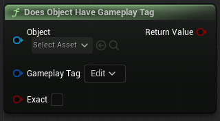
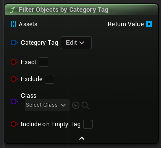
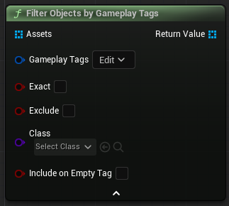
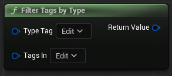
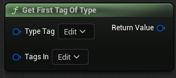
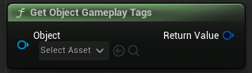
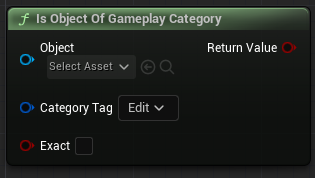
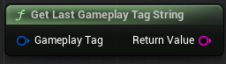
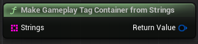
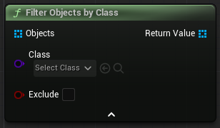

## 
Gameplay Tags

Many of these functions (specifically any involving UObjects) require the use of the **Gameplay Tags Interface**.
***
#### 
| - | Name | Description |
| - | - | - |
|  | `Does Object Have Gameplay Tag` | |
 | `Filter Objects By Category Tag`
| `Filter Objects by Gameplay Tags` | 
 | `Filter Tags by Type `|
 | `Filter First Tag of Type`
 | `Get Object Gameplay Tags` |
 | `Is Object of Gameplay Category` | 
 | `Get Last Gameplay Tag as String` | E.G. The gameplay tag *'Item.Consumable.Potion'* would return as the string *'Potion'*
 | `Make Gameplay Tag Container from Strings` | 
| `Make Gameplay Tag from String` |

## 
Objects

| - | Name | Description |
| - | - | - |
 | `Filter Objects by Class` |
