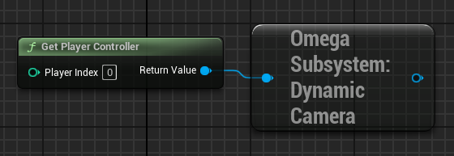

# Dynamic Camera Subsystem
The Dynamic Camera Subsystem allows you to set up more advance cameras and automatically blend between them based on priority.

____
## Subsystem
You can get the `OmegaDyanmicCameraSubsystem` from a `PlayerController`. 

You can activate the Dynamic Camera by calling `SetDynamicCameraActive` from the subsystem *OR* By activating the [GameplaySystem](../gameplay_systems.md) *System_Event_DynamicCamera*.

There are two main cameras running in the dynamic camera system.
* **Master Camera**: The main camera used as your view target. This can be changed in `Project Settings > Omega: Framework > Dynamic Camera Class`
* **Source Camera** This is the Camera the Master Camera is currently trying to blend it's transform, FOV, and spring arm length to. Normally the source camera is selected from the **active** DynamicCameraActor with the highest priority. However, you can set a manual source camera with `SetOverrideCamera`.

##### Functions

| Name | Description |
|-|-|
| `SetDynamicCameraActive` | Toggles the Dynamic Camera On/Off. Setting off will reset the `ViewTarget` to the Player Pawn.
| `SetOverrideCamera` | Overrides the `Source Camera` to use a speficic actor.
| `ClearOverrideCamera` | Removes the Override Camera, and returns to using the priority source camera.
| `SetOverrideCamera` | Overrides the `Source Camera` to use a speficic actor.
| `SnapToCurrentSource` | Snaps the `Master Camera` to the current `Source Camera` instead of waiting for it to finish blending.

____
## Dynamic Camera Actor

The Dynamic camera actor is a pawn that acts as a camera source for the subsystem. They can be manually placed in the world, OR spawned in using the **DynamicCameraInstance** Component.

##### Paramters
| Name | Description |
|-|-|
| `Priority` | This cameras number on the priority list. The hightest priority ACTIVE camera will be what the dynamic camera blends too.
| `CameraActive` | If true, this camera will be evaluated in the list of Dynamic Cameras to blend too.
| `InterpSpeed` | The speed at which the Master camera will blend to this Camera when it is the chosesn source. `InterpSpeedLocation` & `InterpSpeedLocation` can override this value for thos specifically.

##### Functions

| Name | Description |
|-|-|
| `EventActiveTick` | Tick that ONLY plays when this camera is active.