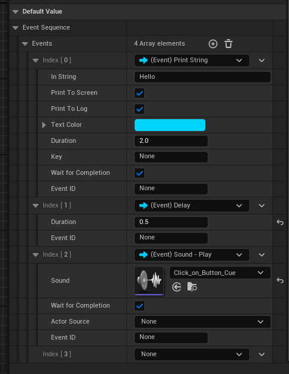
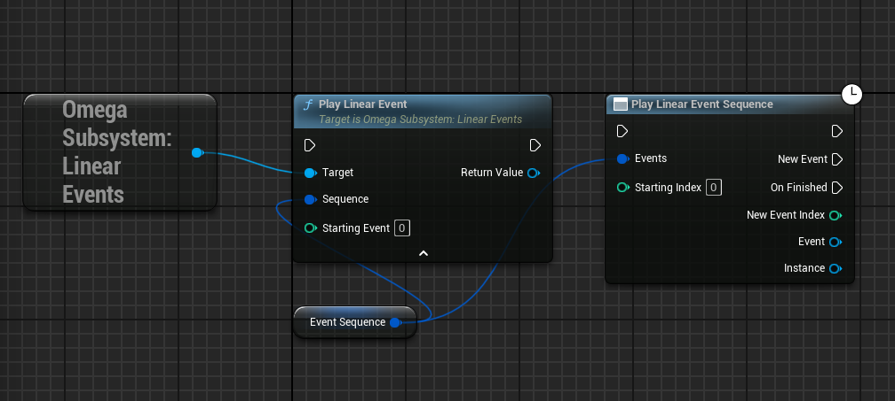
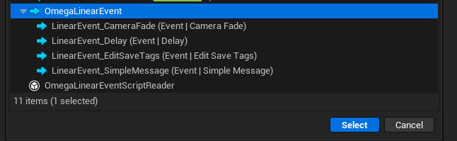
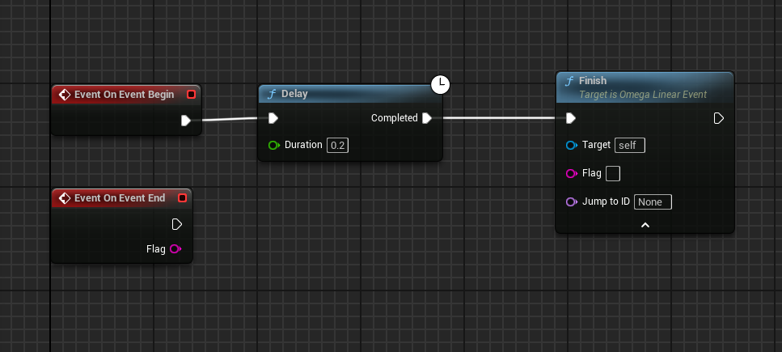
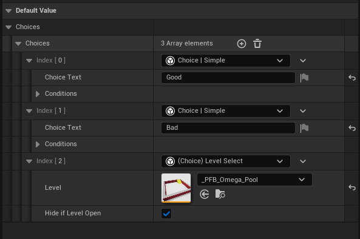
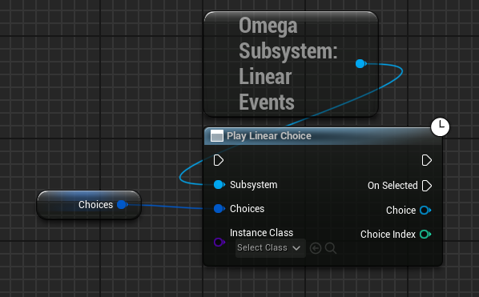
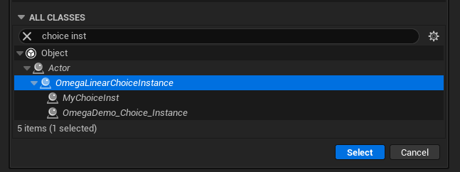
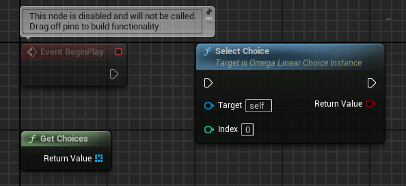

# Linear Events

Linear events allow you to create a sequence of scripted, data-driven, async events for your game.

You can create a new sequence with the `LinearEventSequence` variable

Then call the event sequence either from the `Subsystem` or as an async event.

#### Create a Linear Event

You can create a new linear event from the blueprint creation menu.

From there you can write your own logic for running the event.

Call `Finish` to end and destroy the event instance. You can use `Jump to ID` to jump to a specfici linear event in this sequence if you don't want to simply advance to the next event.

____
## Linear Choices

Linear Choices allow for a branch events from player input.

Create a new choice with a `FOmegaLinearChoices` variable.
 

Call the choice.

A `ChoiceInstanceActor` class is needed to runt he choice event. If you don't want to use a default on, you can create your own.

 