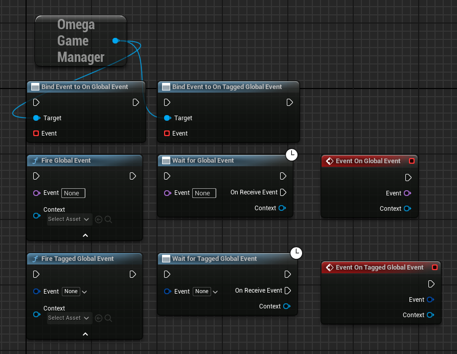
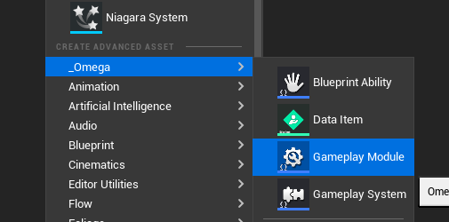
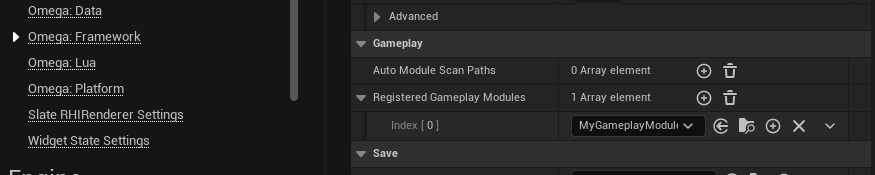
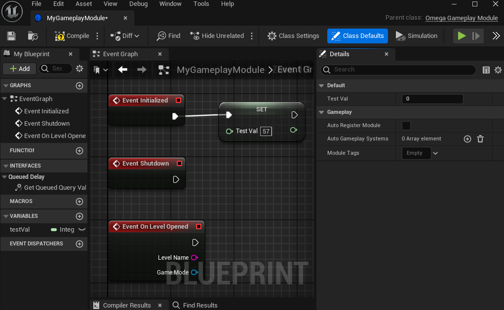
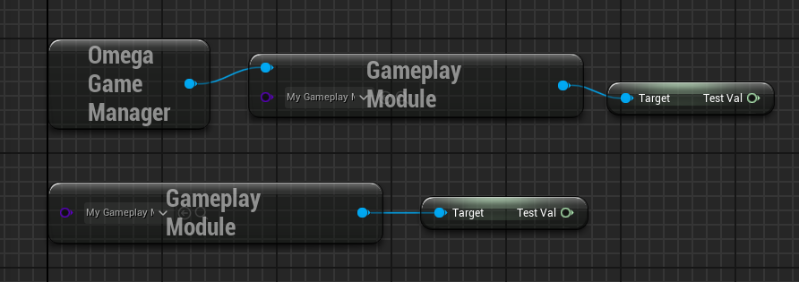

# Omega Subsystem: Game Manager
The **OmegaGameManager** subsystem handles all primary GameInstance-wide events and systems, such as  Gameplay Modules.

___
### Global Events
Global events are soft name-based event calls fired from the GameManager and can be received by any object with the **OnGlobalEvent** event dispatcher attatched, OR by using the "Wait for Global Event" async task.

Theses classes have **OnGameplayEvent** already added to them.
* GameplayModule
* GameplaySystem
* HUDLayer
* Menu
___
### Gameplay Modules

Gameplay Modules are Game-Instance level objects that run persistent across your entire projects. They are the bluepritn version of `GameInstanceSubsystems`.

1. Create a Gameplay Module

2. Under `Project Settings>Omega: Framework` add it to the list of `Registered Gameplay Modules`

3. Edit your Gameplay Module.

4. Access your `GameplayModule` at any time using the global function call or GameManager Subsystem.

#### Events
| Name | Description |
|-|-|
| *`Initialized`* | Called when the module is activated on game startup.
| *`Shutdown`* | Called when the module is destroyed on game shutdown.
| *`OnLevelOpened`* | Called whenever a new level is opened. |
| *`OnGameFileSaved`* | Called whenever the current save game is written to disk. |
| *`OnGameFileStarted`* | Called whenever a loaded save is started as the active game. |

#### Variables
| Name | Type | Description |
|-|-|-|
| *`Auto Gameplay Systems`* |`TArray<TSubclassOf<AOmegaGameplaySystem>>` | Gameplay Systems automatically activated whenever a new level is opened.
| *`Module Tags`* | `FGameplayGameContainer` | Called whenever a loaded save is started as the active game. |