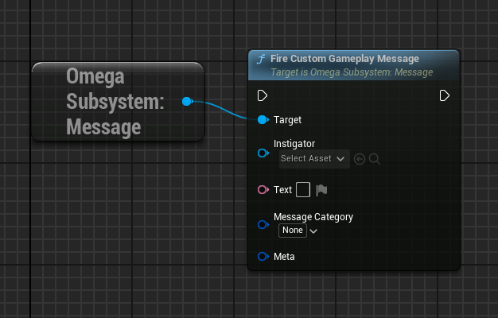
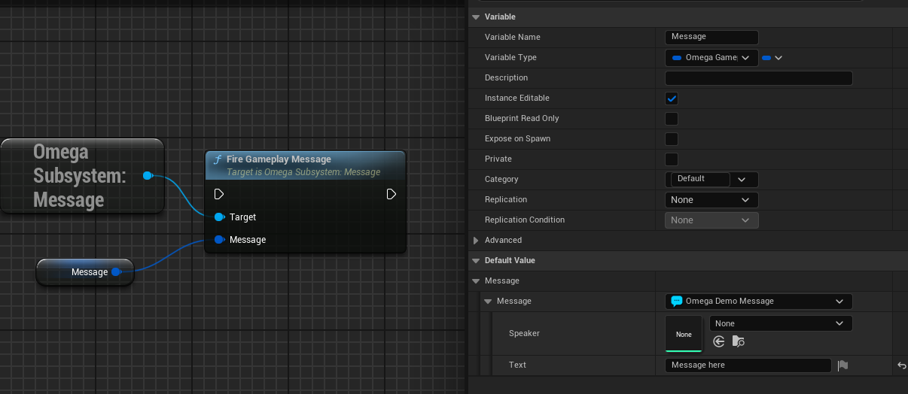
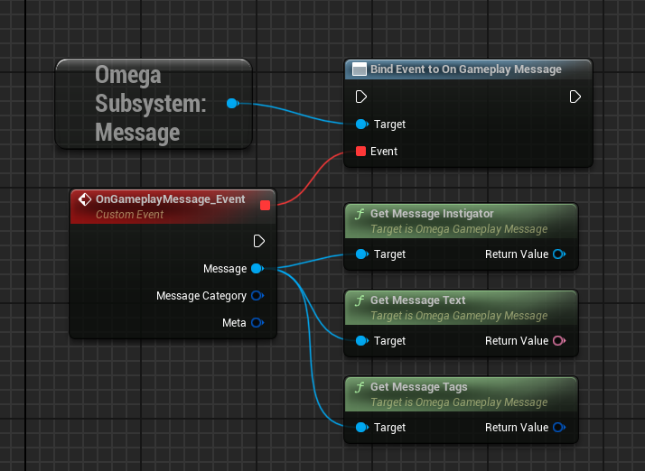

## Gameplay Messages

Gameplay messages are logged events with Text, an insitgator object, and lua metadata.

* You can fire a custom gameplay message..

* ..or use a scirpted blueprint message.

The message can then be recieved with the `OnGameplayMessage` delegate.

**NOTE**: `HUDLayers` and `Menus` already have a `OnGameplayMessage` event.