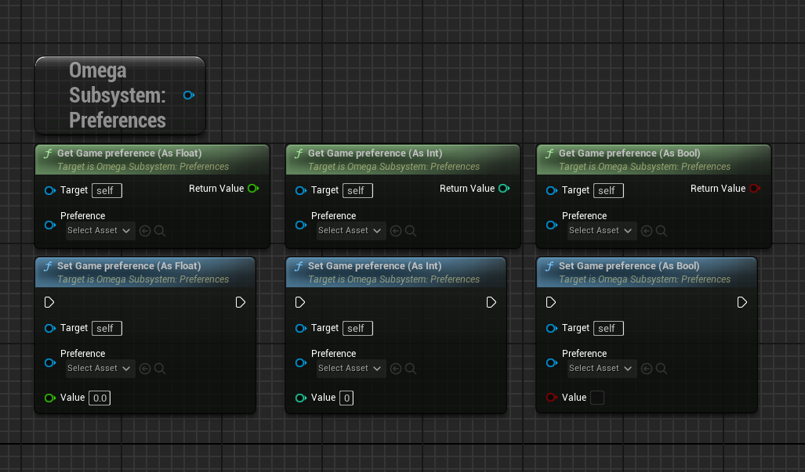
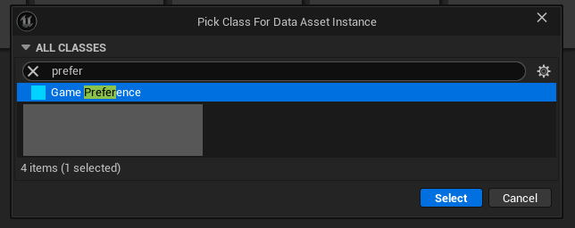
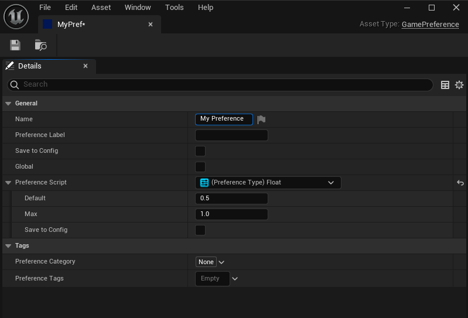
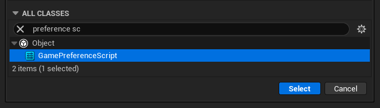
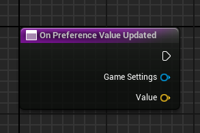
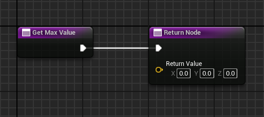
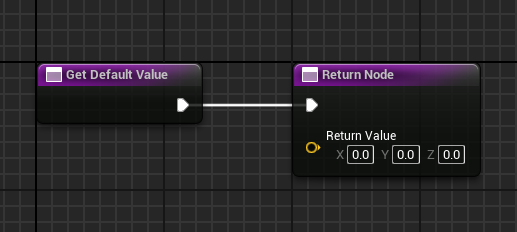

## Game Preferences

Game Preferences are settings that can be edited by the player and saved to either the `GameSave` or `GlobalSave` files.

#### Editing Preference Values

#### Create a New Preference

Create a new preference from the DataAsset menu.

 

#### Create a Preference Script

You can create a new preference script from the blueprint menu.

Preference values as saved a `FVectors`. You can set up in the script how these values are determined.
| | | 
|-|-|-|