# Omega Subsystem: Saving
Omega's save susystem provides an easy way to save and load game data to disk. There are two kinds of saves.

| Game Save | Global Save |
|-|-|
Contains data for the current game, and can be saved to an numbered slot. A new **GameSave** is always created when the game starts up. | A single save that contains persistent game data that is automatically saved upon closing the game. On startup, a **GlobalSave** will attempt to be loaded from disk, and if unsucessful a new one will be created.

### Saving Data (Soft Property)
The easiest way to save data is to get the **Omega Save Subsystem** and then calling 'Set' of 'Get' for the various save properties, as well as whether to save them to the "Game" or "Global" save file.

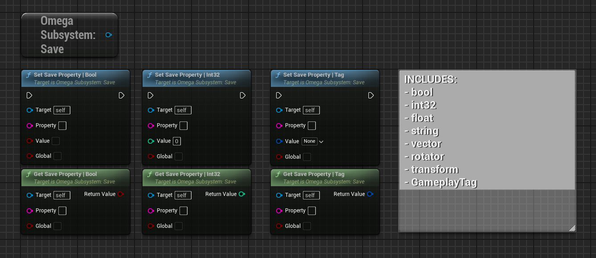

### Saving Data (Object JSON)
A second way to save is with the `OmegaSaveInterface`. Adding this interface to an object, you can then handle saving data to and from a json field in the main save. 

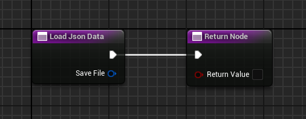
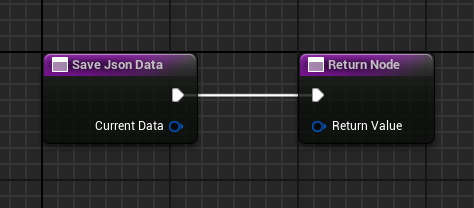

`UseJsonSaveData` Must be set `true` for saving from this object to work.

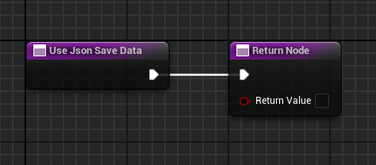

This name will be the field the data is saved too. Be sure not to use any name more than once, or it will override that save data.

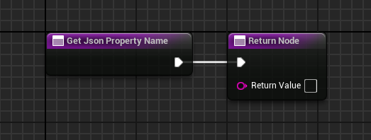

Data for that object can be loaded using `SaveObjectJsonData` & `LoadObjectJsonData` from the Subsystem, OR with the `Save/Load Self JsonData` macro, which will automatical try to save/load data from the object it's called in. 

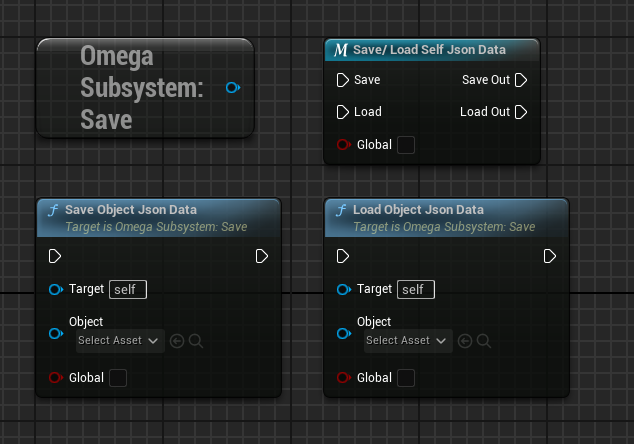

### Collected Assets/Guids
Global & Game saves both contain a list of 'collected' **DataAssets** and **GUIDs**. These can be a very easy way of keeping track of collected objects or game data.

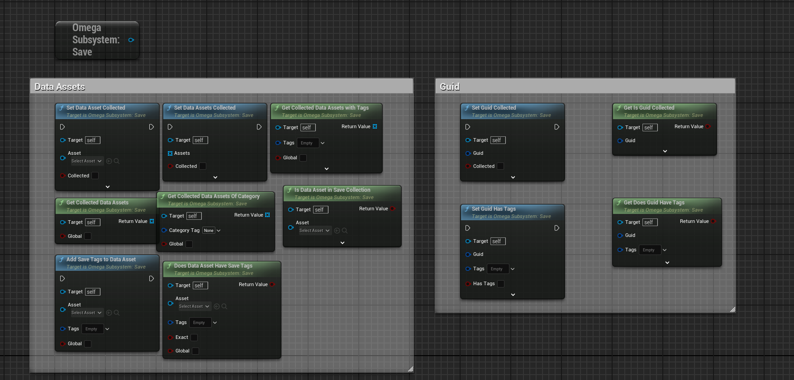

### Story States
Story States are assets that can be activated/deactivated and are saved in you game file. They allow you to set up various rules to edit saves & load data/sublevels/actors depending on the narratve state the player is at.

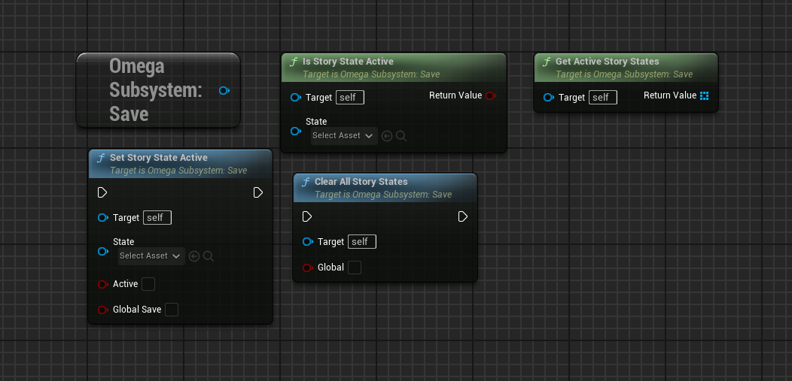

You can create new story states with the `OmegaStoryState` DataAsset.

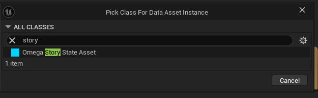
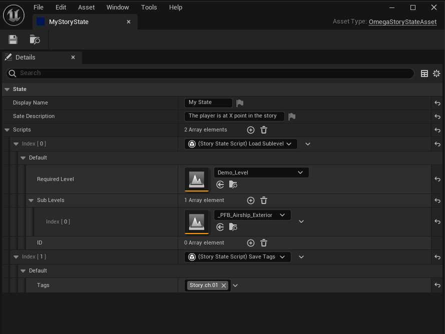

New state scripts can create from the `OmegaStoryStateScript` blueprint.

### Actor Save State
Individual Actors can be saved with a GameplayTag to retain a certain state upon reloading. This can be done by using the ActorState Component.

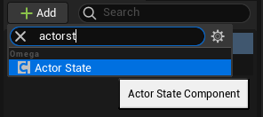
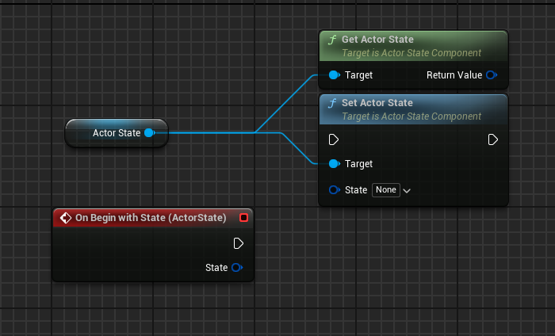