# Omega Subsystem: Zones
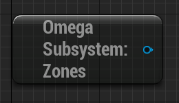

A subsystem for handling level zones and better transitioning between levels. 

## To use

### Zones
Zones are determined with a data asset called **Omega Zone Data**.

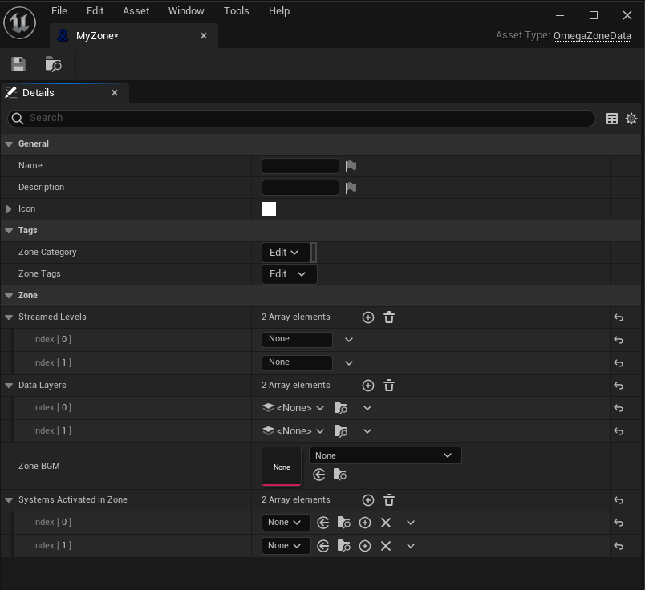

### Levels
**OmegaLevelData** contains metadata for a specific level asset t work alongside the Zonesubsystem.

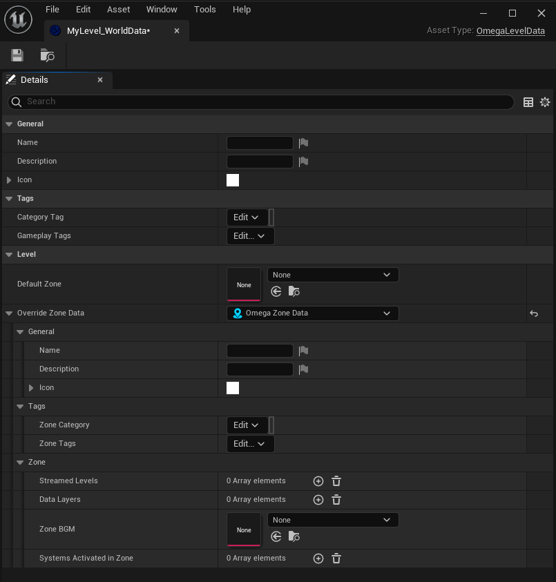

**NOTE**: For a Level Data Asset to work, it must be in the same directory as the Level asset and share the same name, with the suffex `_WorldData` added.

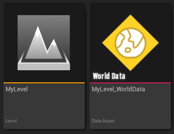

### Transitions
The Zone Manager allows you to setup and use transitions between zones and levels with two actors.
| OmegaSpawnPoint | OmegaZoneTransit |
|-|-|
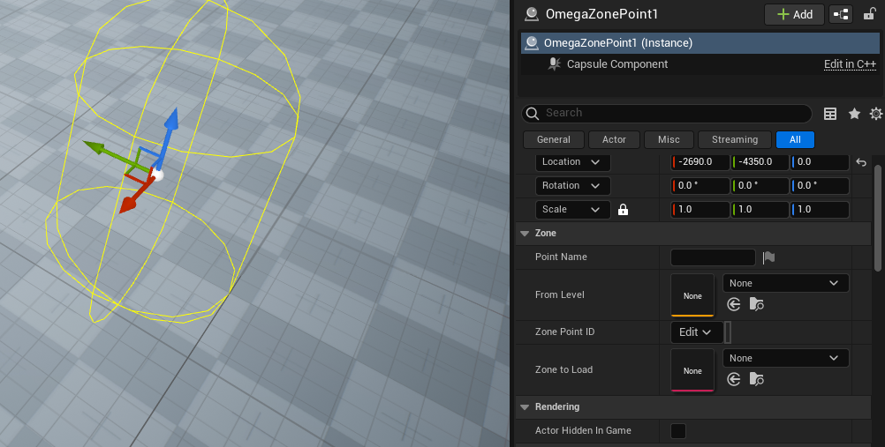|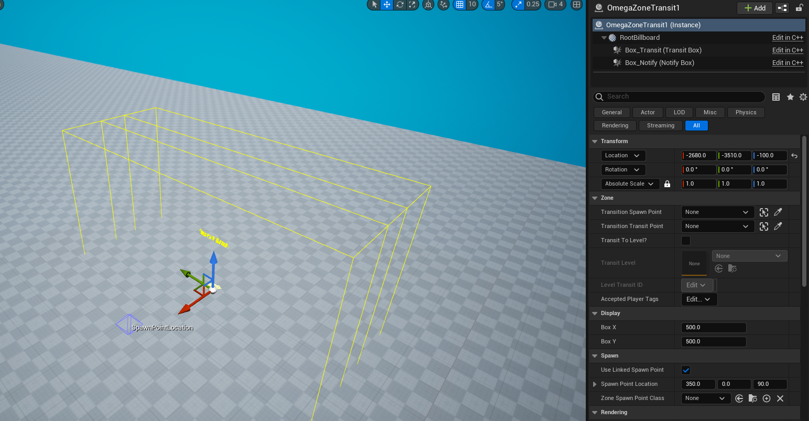
| Acts as a reference point to spawn/transition the player's pawn to. **From Level** means when transitioning from that level, spawn at this point. If multiple points have that level, use **ZonePointID** to differentiate. | Acts as a trigger volume to transition to a new SpawnPoint or Level. Used **LinkedSpawnPoint** or **LinkedTransitPoint** to determine where to transit to upon the player pawn entering. Use **TransitToLevel** to open a new level and spawn the player at a specific spawn ID. |

### Project Settings
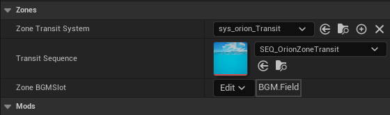
| Name | Description |
| - | - |
| `Zone Transit System` | Gamepaly System that will activate when a transition even begins, and shutdown upon the transition finishing.
| `Transition Sequence` | Level Sequence that will play forward when a transition event begins and backwards when the transition finishes.
|`Zone BGM Slot`| The BGM slot the play Zone BGMs in.

## Subsystem Functions

| - | Name | Description |
| - | - | - |
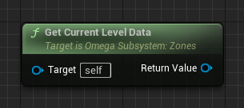| `Get Current Level Data` |
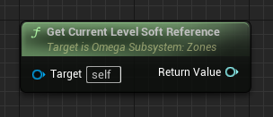 | `Get Current Level Soft Reference` | Gets a soft object reference to the current level.
| `Get Current Level Data`|
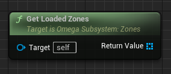 |`Get Loaded Zones`|
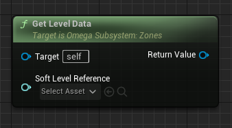| `Get Loaded Zones`|
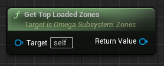| `Get Top Loaded Zone`| Gets the ZoneAsset for the currently loaded zone.
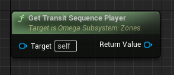| `Get Transit Sequence Player` 
| `Load Default Zone`
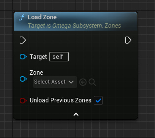| `Load Zone`
|`Transit Player to Level (Name)`A| 
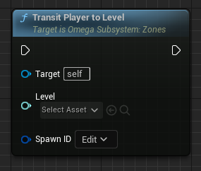| `Transit Player to Level`A|  
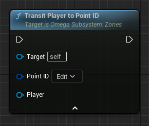| `Transit Player to Point ID`A| 
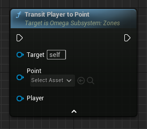| `Transit Player to Point`A| 
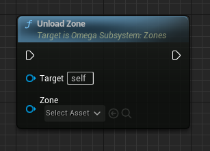| `Unload Zone`
| `Is Zone Loaded`

<ol type="A">
  <li>If no "player" is input, will default to Player 0.</li>
</ol>
