# Omega Game Framework: Documentation

**NOTE**: OGF is desgined as an alternative to UE's "Gameplay Ability System". While not technically *incompatible*, it is NOT recommended to have both active in a project.

* [GettingStarted](docs/tutorial/1_install.md)

____
### Subsystems
||Name|Type|Description|Doc Status|
|-|-|-|-|-|
|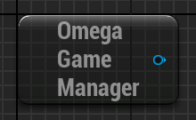|[Game Manager](../docs/docs/subsystems/subsystem_manager.md)|**Game Instance**| Create & manage *Gameplay Modules*, & Fire **Global Events** | ✅READY
|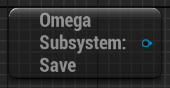|[Save](../docs/docs/subsystems/subsystem_save.md)|**Game Instance**| Save and Load the **Active** & **Global** game data. | ✅READY
|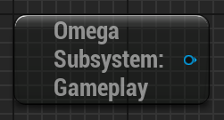|[Gameplay](../docs/docs/subsystems/subsystem_gameplay.md)|**World**| Create & manage *Gameplay Systems*. | ✅READY
||[Player](../docs/docs/subsystems/subsystem_player.md)|**Player**| Player-specific subsystem for handling UI and input. | 🟡WIP
|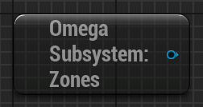|[Zone](../docs/docs/subsystems/subsystem_zone.md)|**World**| Subsytem for managing between level zones & transitioning between levels. | ✅READY
|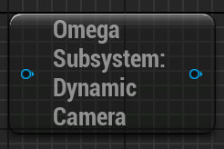|[Dynamic Camera](../docs/docs/subsystems/subsystem_camera.md)|**World**| Subsystem for dynamically blending between various cameras based on a priority list. | 🟡WIP
|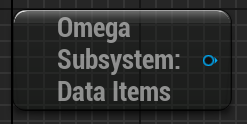|[Data Item](../docs/docs/subsystems/subsystem_dataItems.md)|**Game Instance**| DataAssets with modular traits that can be accessed or effect an actor. | ❌Incomplete
|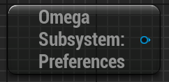|[Game Preferences](../docs/docs/subsystems/subsystem_preferences.md)|**Game Instance**| User-specific prefernced that can be edited and saved as a `FVector` in the `Game` or `Global` saves. | ✅READY
|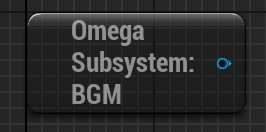|[BGM](../docs/docs/subsystems/subsystem_bgm.md)|**World**| Subsytem for playing and managing BGM (music).| 🟡WIP
|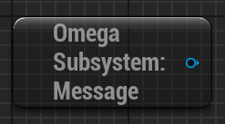|[Message](../docs/docs/subsystems/subsystem_message.md)|**Game Instance**| Fire & Log ``FText`` messages for gameplay purposes. | 🟡WIP
|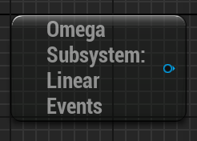|[Linear Events](../docs/docs/subsystems/subsystem_linearEvents.md)|**World**| Run & manage **Linear Events** graphs for *linear* data-driven, async gamepaly events. | ✅READY
|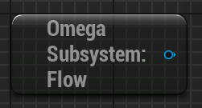|[Flow](../docs/docs/subsystems/subsystem_flow.md)|**World**| Run & manage **FlowAsset** graphs for *branching* data-drive, async gamepaly events. | ❌Incomplete
|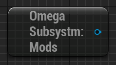|[Mods](../docs/docs/subsystems/subsystem_mods.md)|**Game Instance**| Load ``.lua`` and Override files from the Mods folder | 🟡WIP
|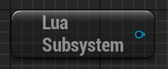|[Lua](../docs/docs/subsystems/subsystem_lua.md)|**Game Instance**| Runing local lua files | 🟡WIP

____
### Components
||Name|Description|Doc Status|
|-|-|-|-|
||[Combatant](../docs/docs/components/comp_combatant.md)| Manage **Attributes** & **Abilites** as well as recieve **Gameplay Effects**| 🟡WIP
||[Combatant Extension](../docs/docs/components/comp_combatant.md)| Add additionally functionallity relevant to the ``Combatant Component``. | 🟡WIP
||[Actor State](../docs/docs/components/comp_ActorState.md)| Save a `Gameplay Tag` as an actor state, that will be reloaded when the actor or game is reloaded. | ❌Incomplete
||[Actor Targeting](../docs/docs/components/comp_ActorTargeting.md)| Add actors to a registry list and cycle through them to get a "target" actor.  | 🟡WIP
||[Combat Encounter](../docs/docs/components/comp_CombatEncounter.md)| Creates a `Stage` and `Encounter` instance ofr handling gameplay encoutners involving combatants. | ❌Incomplete
||[Equipment](../docs/docs/components/comp_equipment.md)| "Equip" ``Data Assets`` to slots, with options to have the equipment modify combatant ``skills`` & ``attributes``. | 🟡WIP
||Gameplay Systems| Activates a list of gameplay systems which are deactivated upon the component's destruction.| 🟡WIP
||[Instanced Actor](../docs/docs/components/comp_InstanceActor.md)| Creates instances of an actor, using the same functionality with different context objects.| 🟡WIP
||[Inventory](../docs/docs/components/comp_inventory.md)| Add and store an int32 count of ``Data Assets``.| ❌Incomplete
||[Leveling](../docs/docs/components/comp_leveling.md)| Add XP and calculate a level/rank for a an actor based on a custom curve asset.| 🟡WIP
||[Skin](../docs/docs/components/comp_skin.md)| For Modular Characters. Creates a child actor to a ``Character``, binding all it's ``SkeletalMeshComponents`` to the owning character's ``AnimInstance``. | ❌Incomplete
||[Subscript](../docs/docs/components/comp_subscript.md)| A simple ECS-style component. Add extra custom functionality to an actor from a instanced subscript or ``CollectionAsset`` of subscripts. | ❌Incomplete
||[Tool Actor](../docs/docs/components/comp_ToolActor.md)| Cycle through a list of actors that can be activated and play montage animations. | ❌Incomplete
||[Quest](../docs/docs/components/comp_quest.md)| Create & save a state of a list of gameplay events. | ❌Incomplete
||[Turn Manager](../docs/docs/components/comp_TurnManager.md)| Registers & generates a turn-order for a list of combatants, using a custom ability to manage a turn. | ❌Incomplete
||[Zone Entity](../docs/docs/components/comp_ZoneEntity.md)| Registers this actor to the ``Zone Subsystem``, allowing them to be dispalyed in a minimap. | 🟡WIP
||[Grid3D](../docs/docs/components/comp_Grid3D.md)| Create a grid of 3D Tile Actors in the world space. | ❌Incomplete

____
### Actors
||Name|Description|Doc Status|
|-|-|-|-|
||[Abilities]()|Modular gameplay actions managed and executed by a ``CombatantComponent``. | ❌Incomplete
||[Environment]()| Actor containing components for lighting and tening a level. (I.E. ``Atmopshere``, ``Clouds``, ``Fog``, ``SkyLight``, ``DirectionalLight``, ``PostProcess`` etc.) | ❌Incomplete
||[Combatant Selector]()| Pawn for inputing and selecting from a list of combatants. | ❌Incomplete
||[Gameplay Effect]()| Actor attached to a ``CombatantComponent`` to modify it's status and behavior. | ❌Incomplete
||[Gameplay Cue]()| Cosmetic-only actor containing a `Niagara` & `Audio` component. | ❌Incomplete
||[Bullet]()|Projectile that applies effects when hitting a combatant. | ❌Incomplete
||[Advanced Volume]()| Advanced Volume actor utilizing color, icon, and text. | ❌Incomplete
||[Pickup]()|Actor that plays an effect when overlaping with the player, and is then destroyed. | ❌Incomplete
||[Randomized Mesh]()| Randomly selects a mesh to display & offset from a int32 seed, which can be determined by the actors world position. | ❌Incomplete

____
### Features/Functions
||Name|Description|Doc Status|
|-|-|-|-|
|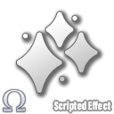|[Scripted Effects]()|Apply effects to a combatant from a data script. | ❌Incomplete
||[Animation Emotes]()|A ``DataAsset`` that playes an anim montage on a character, determined based the character's anim instance. | ❌Incomplete
|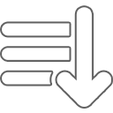|[Object Sorter]()|Sort and Filter an array of UObjects with a Sorter Asset. | ❌Incomplete
||[Scripted Trace]()|Run a single or multi trace from a script. | ❌Incomplete
||[Tag Events]()| Fire nont-specific `GameplayTag`-based events on an actor or group of actors. | ❌Incomplete

____
### Widgets
||Name|Description|Doc Status|
|-|-|-|-|
||[Data Widgets](../docs/docs/widget/widget_dataWidgets.md)|Display data from a given 'source asset' object.| ❌Incomplete
||[Data Lists](../docs/docs/widget/widget_datalists.md)| Displays a list of ``Data Widgets`` from an object array, aligning them based on a layout script.| ❌Incomplete
||[Data Tooltip](../docs/docs/widget/widget_dataWidgets.md)| Hover tooltip for ``Data Widgets``. | ❌Incomplete
|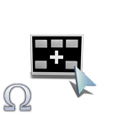|[Menu](../docs/docs/widget/widget_menu.md)| Async widget that allows for player input. | ❌Incomplete
|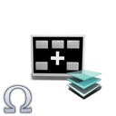|[HUD Layer](../docs/docs/widget/widget_popup.md)| Non-interactive widget typically activated with ``GameplaySystems``, intend to display gameplay data.| ❌Incomplete
||[Popups](../docs/docs/widget/widget_popup.md)| A widget with a lifetime spawn based on a world position and display custom text/input data.| ❌Incomplete

