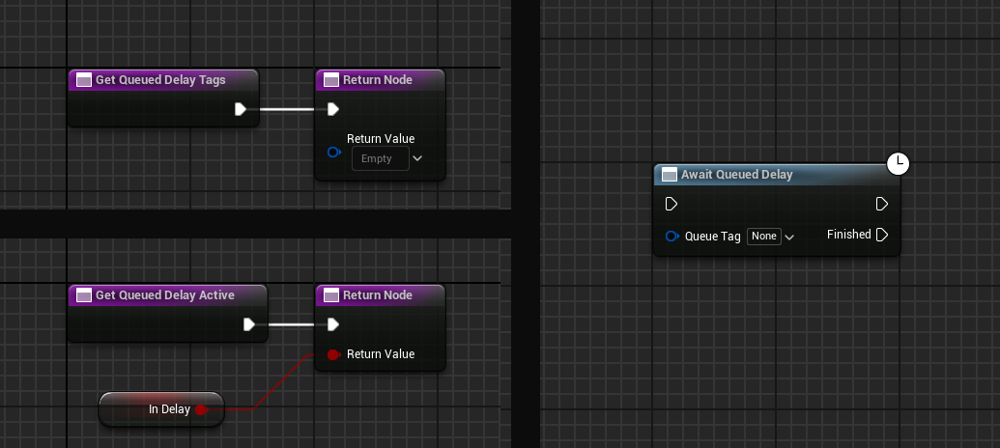
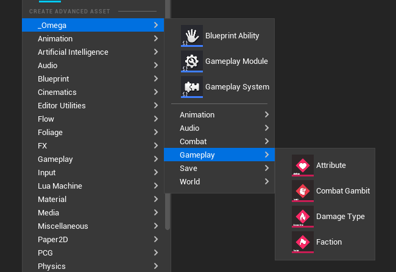

## Update 1.4.4

#### CombatEncounterComponent
* Added Encounter Script paramater
* Added BGM & IntroSequence parameters

#### Combat Gambits
* Added Target Selector Gambits
* IF conditions are now arrays so you can check multiple conditions.

#### Game Preferences
* Added the "SaveToConfig" option, allowing preference values to be red/writen to "OmegaPreferences.ini"

#### [**NEW**] Queued Delays
* Queded Delay allows you to delay an event advancing until a list of registed objects have all been marked as inactive (I.E. not delaying said advanced). This can be used for modulalrly blocking load or event states to avoid bugs.
* GameplaySystems have the queued delay inerface built in automatically.

#### Data List/Data Widgets
* Added SizeBox Param and made if Overridable.

#### New Content
* Added Kenny Assets: [Rocks, Trees]
* Added DamageReactions Types: [Absorb, Lethal, Resist, Strong, Weak]
* Added Demo Encoutner_Stages: [Row3, Row4]

#### Editor/QOL
* Added more OmegaAssets into the NewAsset Menu.
* Added New Asset Icons for [CombatEncounters, Skin, GambitTarget, SaveVisibilityComponent, GameplayPause Component]